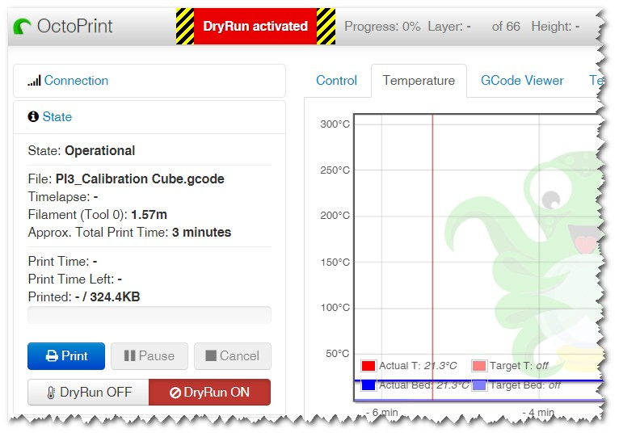

# DryRun
A Octoprint-Plugin that allows to execute a print without heating your bed or nozzle, turning on any fans, or extruding any filament.

The implementation is based on the "test-mode" from [Octolapse](https://github.com/FormerLurker/Octolapse/)

## Setup
Install via the bundled [Plugin Manager](http://docs.octoprint.org/en/master/bundledplugins/pluginmanager.html)
or manually using this URL:

    https://github.com/OllisGit/OctoPrint-DryRun/archive/master.zip

## Configuration
Done via Settings-Menü

## Versions
see [Release-Overview](https://github.com/OllisGit/OctoPrint-DryRun/releases/)
